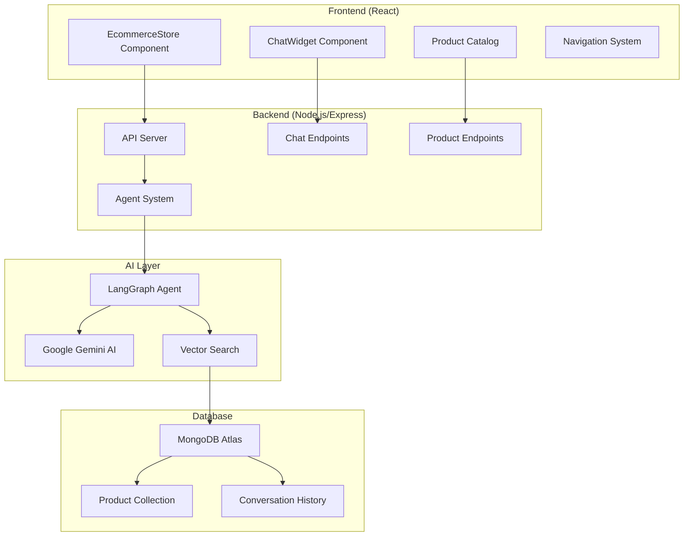

# 🛍️ Cart-Sense: AI-Powered E-commerce Platform

<div align="center">


**A modern, intelligent e-commerce platform featuring AI-powered shopping assistance, dynamic product catalog, and seamless user experience.**

[🚀 Live Demo](#) • [📖 Documentation](#) • [🐛 Report Bug](#) • [✨ Request Feature](#)

</div>

---

## ✨ Features

### 🤖 **AI Shopping Assistant**

- **Intelligent Chat Interface**: Powered by Google Gemini AI with LangGraph
- **Contextual Conversations**: Maintains conversation history across sessions
- **Smart Product Search**: Vector-based semantic search through inventory
- **Real-time Recommendations**: Dynamic product suggestions based on queries

### 🛒 **Modern E-commerce Store**

- **Dynamic Product Catalog**: Real-time data from MongoDB database
- **Category-based Navigation**: Smart filtering across Home, Electronics, Clothing, etc.
- **Responsive Design**: Beautiful UI with glass morphism and gradient themes
- **Interactive Product Cards**: Hover effects, pricing, and add-to-cart functionality

### 🔧 **Technical Excellence**

- **Full-Stack Architecture**: React frontend + Node.js/Express backend
- **Database Integration**: MongoDB Atlas with vector search capabilities
- **Type Safety**: Complete TypeScript implementation
- **Modern UI/UX**: Inter font, smooth animations, and professional styling

---

## 🏗️ Architecture



---

## 🚀 Quick Start

### Prerequisites

- Node.js 18+
- MongoDB Atlas account
- Google AI API key

### Installation

1. **Clone the repository**

   ```bash
   git clone https://github.com/yourusername/cart-sense.git
   cd cart-sense
   ```

2. **Install dependencies**

   ```bash
   # Install server dependencies
   cd server
   npm install

   # Install client dependencies
   cd ../client
   npm install
   ```

3. **Environment Setup**

   ```bash
   # Create .env file in server directory
   cd ../server
   touch .env
   ```

   Add your environment variables:

   ```env
   MONGODB_ATLAS_URI=your_mongodb_atlas_connection_string
   GOOGLE_API_KEY=your_google_ai_api_key
   PORT=8000
   ```

4. **Seed the database**

   ```bash
   cd server
   npm run seed
   ```

5. **Start the application**

   ```bash
   # Terminal 1: Start backend server
   cd server
   npm run dev

   # Terminal 2: Start frontend
   cd client
   npm start
   ```

6. **Access the application**
   - Frontend: http://localhost:3000
   - Backend API: http://localhost:8000

---

## 🛠️ Tech Stack

### Frontend

- **React 19.1.1** - Modern UI framework
- **React Icons** - Beautiful icon library
- **React Markdown** - Rich text rendering
- **CSS3** - Modern styling with animations

### Backend

- **Node.js** - Runtime environment
- **Express.js** - Web framework
- **TypeScript** - Type-safe development
- **CORS** - Cross-origin resource sharing

### AI & Database

- **LangChain** - AI application framework
- **LangGraph** - State management for AI agents
- **Google Gemini AI** - Large language model
- **MongoDB Atlas** - Cloud database
- **Vector Search** - Semantic product search

### Development Tools

- **TSX** - TypeScript execution
- **ESLint** - Code linting
- **Prettier** - Code formatting

---

## 📁 Project Structure

```
cart-sense/
├── client/                    # React frontend
│   ├── src/
│   │   ├── components/
│   │   │   ├── EcommerseStore.js    # Main store component
│   │   │   └── ChatWidget.js        # AI chat interface
│   │   ├── App.js                   # Root component
│   │   ├── App.css                  # Global styles
│   │   └── index.js                 # Entry point
│   └── package.json
├── server/                    # Node.js backend
│   ├── agent.ts              # LangGraph AI agent
│   ├── index.ts              # Express server
│   ├── seed-database.ts      # Database seeding
│   ├── package.json
│   └── tsconfig.json
└── README.md
```

---

## 🤖 AI Agent Features

### Intelligent Product Search

- **Vector Embeddings**: Products stored with semantic embeddings
- **Natural Language Queries**: "I need a comfortable sofa for my living room"
- **Contextual Results**: AI understands intent and context
- **Fallback Search**: Text-based search when vector search fails

### Conversation Management

- **Thread Persistence**: Maintains conversation history
- **Context Awareness**: Remembers previous interactions
- **Error Handling**: Graceful degradation with retry logic
- **Rate Limiting**: Built-in protection against API limits

### Smart Recommendations

- **Category Mapping**: Automatically categorizes products
- **Price Intelligence**: Shows sale prices and original prices
- **Product Details**: Rich descriptions and specifications
- **Visual Enhancement**: Emoji-based product representation

---

## 🎨 UI/UX Features

### Modern Design System

- **Glass Morphism**: Frosted glass effects with backdrop blur
- **Gradient Themes**: Beautiful purple-to-blue color schemes
- **Smooth Animations**: 60fps transitions and micro-interactions
- **Responsive Layout**: Mobile-first design approach

### Interactive Elements

- **Floating Chat Widget**: Always-accessible AI assistant
- **Category Navigation**: Dynamic filtering with active states
- **Product Cards**: Hover effects and smooth transitions
- **Loading States**: Elegant spinners and skeleton screens

### Accessibility

- **Keyboard Navigation**: Full keyboard support
- **Screen Reader Friendly**: Proper ARIA labels
- **High Contrast**: Excellent color contrast ratios
- **Focus Management**: Clear focus indicators

---

## 🔌 API Endpoints

### Chat Endpoints

```http
POST /chat
Content-Type: application/json
{
  "message": "I'm looking for a comfortable sofa"
}

POST /chat/:threadId
Content-Type: application/json
{
  "message": "What's the price range?"
}
```

### Product Endpoints

```http
GET /products
# Returns categorized product data
{
  "Home": [...],
  "Electronics": [...],
  "Clothing": [...],
  "Home & Kitchen": [...],
  "Beauty": [...],
  "Sports": [...],
  "Deals": [...]
}
```

---

## 🗄️ Database Schema

### Products Collection

```typescript
interface Product {
  item_id: string;
  item_name: string;
  item_description: string;
  brand: string;
  manufacturer_address: {
    street: string;
    city: string;
    state: string;
    postal_code: string;
    country: string;
  };
  prices: {
    full_price: number;
    sale_price: number;
  };
  categories: string[];
  user_reviews: Array<{
    review_date: string;
    rating: number;
    comment: string;
  }>;
  notes: string;
  embedding: number[]; // Vector embeddings
  embedding_text: string; // Text used for embeddings
}
```

---

## 🚀 Deployment

### Frontend Deployment (Vercel/Netlify)

```bash
cd client
npm run build
# Deploy the build folder
```

### Backend Deployment (Railway/Heroku)

```bash
cd server
# Add Procfile for Heroku
echo "web: npx tsx index.ts" > Procfile
# Deploy with environment variables
```

### Environment Variables

```env
MONGODB_ATLAS_URI=your_production_mongodb_uri
GOOGLE_API_KEY=your_production_google_api_key
PORT=8000
NODE_ENV=production
```

---

## 🧪 Development

### Adding New Products

```bash
# Seed database with new products
cd server
npm run seed
```

### Customizing AI Agent

Edit `server/agent.ts` to modify:

- System prompts
- Tool configurations
- Response formatting
- Error handling

### Styling Updates

Modify `client/src/App.css` for:

- Color schemes
- Animations
- Layout changes
- Responsive breakpoints

---

## 🤝 Contributing

We welcome contributions! Please see our [Contributing Guidelines](CONTRIBUTING.md) for details.

### Development Setup

1. Fork the repository
2. Create a feature branch
3. Make your changes
4. Add tests if applicable
5. Submit a pull request

---

## 📄 License

This project is licensed under the MIT License - see the [LICENSE](LICENSE) file for details.

---

## 🙏 Acknowledgments

- **LangChain Team** - For the amazing AI framework
- **Google AI** - For providing the Gemini model
- **MongoDB** - For the robust database platform
- **React Team** - For the incredible UI library

---

## 📞 Support

- 📧 Email: support@cart-sense.com
- 💬 Discord: [Join our community](#)
- 📖 Documentation: [Full docs](#)
- 🐛 Issues: [GitHub Issues](#)

---

<div align="center">

**Built with ❤️ by the Cart-Sense Team**

[⭐ Star this repo](#) • [🍴 Fork it](#) • [🐛 Report bugs](#) • [✨ Request features](#)

</div>
