# 🛍️ CartSense: AI-Powered E-commerce Platform

<div align="center">


**An intelligent shopping assistant that thinks, acts, and adapts like a human sales associate**

</div>

---

## 🎯 About CartSense

CartSense is a sophisticated **AI Agent** built with an **agentic approach** - not just a chatbot that responds, but an intelligent system that autonomously:

- 🧠 **Thinks**: Analyzes customer queries and decides the best action
- 🔍 **Acts**: Searches real product databases using vector embeddings  
- 🔄 **Adapts**: Falls back to alternative search strategies when needed
- 💭 **Remembers**: Maintains conversation context across interactions

---

## ✨ Features

### 🤖 **AI Shopping Assistant**

- **Intelligent Chat Interface**: Powered by Google Gemini AI with LangGraph
- **Contextual Conversations**: Maintains conversation history across sessions
- **Smart Product Search**: Vector-based semantic search through inventory
- **Real-time Recommendations**: Dynamic product suggestions based on queries

### 🛒 **Modern E-commerce Store**

- **Dynamic Product Catalog**: Real-time data from MongoDB database
- **Category-based Navigation**: Smart filtering across Home, Electronics, Clothing, etc.
- **Responsive Design**: Beautiful UI with glass morphism and gradient themes
- **Interactive Product Cards**: Hover effects, pricing, and add-to-cart functionality

### 🔧 **Technical Excellence**

- **Full-Stack Architecture**: React frontend + Node.js/Express backend
- **Database Integration**: MongoDB Atlas with vector search capabilities
- **Type Safety**: Complete TypeScript implementation
- **Modern UI/UX**: Inter font, smooth animations, and professional styling

---

## 🏗️ Architecture Overview

```mermaid
graph TD
    A[👤 User Query] --> B[🤖 LangGraph Agent]
    B --> C{🧠 Decision Engine}
    C -->|Search Needed| D[🔍 Vector Search Tool]
    C -->|Direct Response| E[💬 Generate Response]
    D --> F[📊 MongoDB Atlas]
    F --> G[📋 Search Results]
    G --> E
    E --> H[✅ Final Response]
    
    style A fill:#e1f5fe
    style B fill:#f3e5f5
    style C fill:#fff3e0
    style D fill:#e8f5e8
    style F fill:#fff9c4
```

<div align="center">



</div>

---
## ⚡ Quick Start

### 📥 **Step 1: Clone & Install**

```bash
# Clone the repository
git clone https://github.com/yourusername/cart-sense.git
cd cart-sense

# Install server dependencies
cd server
npm install
```

### 🔧 **Step 2: Environment Setup**

Create a `.env` file in the `server` directory:

```env
# 🤖 AI Model APIs
GOOGLE_API_KEY=your_google_api_key_here

# 🗄️ Database
MONGODB_ATLAS_URI=your_mongodb_atlas_uri_here
PORT=8000
```

### 🌱 **Step 3: Seed the Database**

```bash
# Generate AI-powered synthetic furniture data
npm run seed
```

<details>
<summary>🔍 What happens during seeding?</summary>

- 🤖 **AI generates** realistic furniture and product items
- 📝 **Creates searchable summaries** for each item
- 🔢 **Generates vector embeddings** using Google AI
- 💾 **Stores everything** in MongoDB Atlas

</details>

### 🚀 **Step 4: Start the Backend**

```bash
npm run dev
```

Your AI agent is now running on `http://localhost:8000` 🎉

---

## 🧪 Testing Your AI Agent

### 💬 **Start a New Conversation**
```bash
curl -X POST -H "Content-Type: application/json" \
  -d '{"message": "Do you have any dining tables?"}' \
  http://localhost:8000/chat
```

**Response:**
```json
{
  "threadId": "1703123456789",
  "response": "Yes! I found several dining tables in our inventory. Here's what we have available..."
}
```

### 🔄 **Continue the Conversation**
```bash
curl -X POST -H "Content-Type: application/json" \
  -d '{"message": "What about the price range?"}' \
  http://localhost:8000/chat/1703123456789
```

---

## 🎨 Frontend Setup

### 📱 **Step 5: Launch the React App**

```bash
# In a new terminal, navigate to client directory
cd ../client
npm install

# Start the React development server
npm start
```

Visit `http://localhost:3000` to see your beautiful e-commerce store with integrated AI chat! ✨

---

## 🛠️ Tech Stack

### Frontend

- **React 19.1.1** - Modern UI framework
- **React Icons** - Beautiful icon library
- **CSS3** - Modern styling with animations

### Backend

- **Node.js** - Runtime environment
- **Express.js** - Web framework
- **TypeScript** - Type-safe development

### AI & Database

- **LangChain** - AI application framework
- **LangGraph** - State management for AI agents
- **Google Gemini AI** - Large language model
- **MongoDB Atlas** - Cloud database
- **Vector Search** - Semantic product search

### Development Tools

- **TSX** - TypeScript execution
- **ESLint** - Code linting
- **Prettier** - Code formatting

---

## 🛠️ API Endpoints

| Method | Endpoint | Description | Example |
|--------|----------|-------------|---------|
| `GET` | `/` | Health check | Returns server status |
| `POST` | `/chat` | Start new conversation | Returns `threadId` and response |
| `POST` | `/chat/:threadId` | Continue conversation | Returns response with context |
| `GET` | `/products` | Get product catalog | Returns categorized products |

---

## 📁 Project Structure

```
cart-sense/
├── client/                    # React frontend
│   ├── src/
│   │   ├── components/
│   │   │   ├── EcommerseStore.js    # Main store component
│   │   │   └── ChatWidget.js        # AI chat interface
│   │   ├── App.js                   # Root component
│   │   ├── App.css                  # Global styles
│   │   └── index.js                 # Entry point
│   └── package.json
├── server/                    # Node.js backend
│   ├── agent.ts              # LangGraph AI agent
│   ├── index.ts              # Express server
│   ├── seed-database.ts      # Database seeding
│   ├── package.json
│   └── tsconfig.json
└── README.md
```

---

## 🤖 AI Agent Features

### Intelligent Product Search

- **Vector Embeddings**: Products stored with semantic embeddings
- **Natural Language Queries**: "I need a comfortable sofa for my living room"
- **Contextual Results**: AI understands intent and context
- **Fallback Search**: Text-based search when vector search fails

### Conversation Management

- **Thread Persistence**: Maintains conversation history
- **Context Awareness**: Remembers previous interactions
- **Error Handling**: Graceful degradation with retry logic
- **Rate Limiting**: Built-in protection against API limits

### Smart Recommendations

- **Category Mapping**: Automatically categorizes products
- **Price Intelligence**: Shows sale prices and original prices
- **Product Details**: Rich descriptions and specifications
- **Visual Enhancement**: Emoji-based product representation

---


## 📄 License

This project is licensed under the MIT License - see the [LICENSE](LICENSE) file for details.
